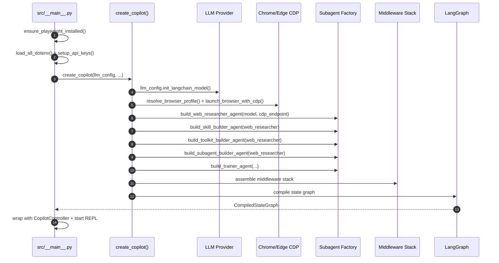

# Architecture Overview

CIRI is a **local-first, multi-agent orchestration system** built on LangChain and LangGraph. Its core design principle is extensibility: every capability can be added, modified, or replaced at runtime without restarting.

---

## Core Module Map

| Module | File | Responsibility |
|---|---|---|
| **CLI Entrypoint** | `src/__main__.py` | Rich terminal UI, Prompt Toolkit REPL, interrupt rendering, startup sequence |
| **Copilot Graph** | `src/copilot.py` | Assembles the LangGraph agent with all middlewares and subagents |
| **Controller** | `src/controller.py` | Thread management, graph execution, streaming |
| **Backend** | `src/backend.py` | `CiriBackend` — subprocess execution, streaming output callbacks |
| **Database** | `src/db.py` | `CopilotDatabase` — SQLite threads table, thread CRUD |
| **Serializers** | `src/serializers.py` | `LLMConfig` — multi-provider model initialization |
| **Middlewares** | `src/middlewares/` | Context injection, safety gates, dynamic capability loading |
| **Subagents** | `src/subagents/` | 5 built-in specialists (web_researcher, builders, trainer) |
| **Toolkits** | `src/toolkit/` | Core tools: web crawler, script executor, human follow-up |
| **Skills** | `src/skills/` | 17 built-in domain playbooks |
| **Utils** | `src/utils.py` | App dirs, browser detection, gitignore parsing, harness discovery |

---

## Startup Sequence



---

## Middleware Stack

The middleware stack wraps every LLM call, injecting context and enforcing safety:

```
User Message
  → InjectNamesMiddleware        (tool + skill + subagent registry)
  → MemoryMiddleware             (workspace .md files)
  → SkillsMiddleware             (domain playbooks)
  → SubAgentMiddleware           (delegation routing)
  → ToolkitInjectionMiddleware   (MCP server tools)
  → HumanInTheLoopMiddleware     (approval gates)
  → TodoListMiddleware           (task tracking)
  → AnthropicPromptCachingMiddleware  (token caching, Anthropic only)
  → LLM Call
  → ToolRetryMiddleware          (retry on failure, skip GraphInterrupt)
  → PatchToolCallsMiddleware     (normalize cross-provider tool call format)
  → SummarizationMiddleware      (compress long contexts)
```

→ [Full Middleware Reference](../internals/middlewares.md)

---

## Two-Level Core Harness

Skills, toolkits, subagents, and memory all follow a **two-level discovery pattern**:

```
~/.local/share/ciri/     ← Core harness (global, all projects)
└── skills/ toolkits/ subagents/ memory/

<project>/.ciri/         ← Project harness (this workspace only)
└── skills/ toolkits/ subagents/ memory/
```

Core harness always loads first. Project harness supplements or overrides on a name-basis.

→ [Core Harness Architecture](core-harness.md)

---

## Data Persistence

| Data | Location | Technology |
|---|---|---|
| Conversation threads | `~/.ciri/data/ciri.db` | SQLite (`threads` table) |
| LangGraph checkpoints | Same database | LangGraph `AsyncSqliteSaver` |
| LangGraph store | Same database | `AsyncSqliteStore` |
| Workspace memory | `.ciri/memory/*.md` | Plain markdown files |
| User settings | `.ciri/settings.json` | JSON |
| API keys | `~/.ciri/.env` + OS keychain | dotenv + `keyring` |

The SQLite database supports **resume-from-checkpoint** — Ciri can continue any thread from exactly where it left off after a restart.

Thread persistence is handled by a local SQLite database.

---

## Streaming Architecture

Ciri streams responses in real time using LangGraph's dual-mode streaming:

```
["updates", "messages"]
  updates  → node state changes + GraphInterrupt signals
  messages → AIMessageChunk tokens (token-by-token text streaming)
```

The `CopilotController.run()` method yields these events to the CLI, which renders them via Rich as they arrive.

---

## Design Goals

1. **Autonomy** — High agency to plan and execute multi-step tasks across any domain
2. **Self-Evolution** — Permanent capability expansion via Skills, Toolkits, and SubAgents
3. **Workspace-Awareness** — Deep integration with local files, memory, and domain context
4. **Safety** — Mandatory Human-in-the-Loop for consequential actions
5. **Extensibility** — Every layer is pluggable: LLM provider, middleware, subagent, skill
6. **Local-First** — No cloud dependency for core function; all data stored locally
