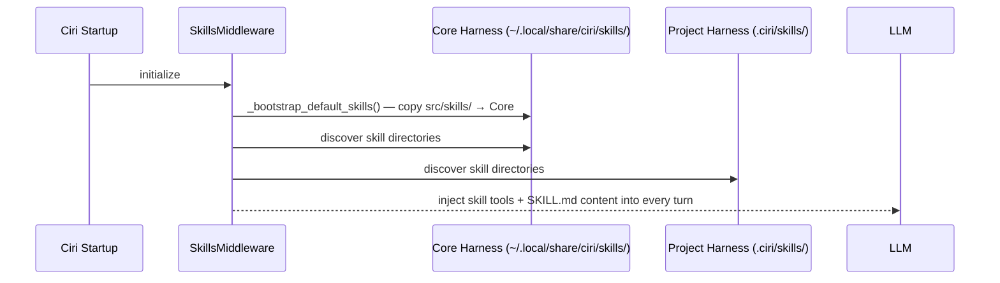

# Built-in Skills

Ciri ships with **17 built-in skills** that are bootstrapped into the global core harness (`~/.local/share/ciri/skills/`) on first run. These skills give Ciri immediate, expert-level capabilities across document processing, design, coding, communications, and more — in any workspace, without needing to train per-project.

Each skill is a directory containing a `SKILL.md` with YAML frontmatter (name, description) and a playbook, plus a `scripts/` folder with supporting Python scripts.

---

## Skill Registry

### Document Processing

| Skill | Trigger | What Ciri Can Do |
|---|---|---|
| **pdf** | Any `.pdf` file or PDF task | Read, merge, split, rotate, watermark, extract tables/images, OCR scanned PDFs, fill forms |
| **docx** | `.docx`, "Word doc", reports, memos | Create new documents with tables/headers/footers/TOC, edit XML directly, add tracked changes, insert comments, convert to PDF |
| **pptx** | `.pptx`, "deck", "slides", "presentation" | Create slide decks from scratch or templates, edit existing slides, convert to images, visual QA |
| **xlsx** | `.xlsx`, `.csv`, spreadsheet tasks | Build/edit Excel models with zero formula errors, create charts, clean messy data, recalculate formulas |

### Design & Creative

| Skill | Trigger | What Ciri Can Do |
|---|---|---|
| **canvas-design** | Poster, visual art, static design | Create `.png`/`.pdf` designs using programmatic layout and design philosophy |
| **algorithmic-art** | Generative art, p5.js, flow fields | Create animated/interactive algorithmic art with seeded randomness |
| **frontend-design** | Web components, landing pages, dashboards | Build production-grade HTML/CSS/React UIs with high design quality |
| **web-artifacts-builder** | Complex multi-component HTML artifacts | Multi-file React + Tailwind + shadcn/ui applications |
| **theme-factory** | "Style this with a theme" | Apply 10 preset or custom-generated themes to any artifact (slides, docs, HTML) |
| **brand-guidelines** | Brand colors, Anthropic style | Apply brand-consistent colors and typography to any artifact |
| **slack-gif-creator** | "Make a GIF for Slack" | Animated GIFs optimized for Slack's constraints (file size, dimensions, fps) |

### Communications & Content

| Skill | Trigger | What Ciri Can Do |
|---|---|---|
| **internal-comms** | Status reports, newsletters, incident reports | Write structured internal communications in company formats |
| **doc-coauthoring** | Writing docs, proposals, specs | Guide structured documentation co-authoring with iterative refinement |

### Engineering & Integration

| Skill | Trigger | What Ciri Can Do |
|---|---|---|
| **mcp-builder** | "Build an MCP server", API integration | Create high-quality MCP servers in Python (FastMCP) or TypeScript (MCP SDK) |
| **webapp-testing** | Test local web app, UI automation | Write Playwright scripts, manage server lifecycle, capture screenshots |

### Meta Skills (Ciri's Self-Improvement)

| Skill | Trigger | What Ciri Can Do |
|---|---|---|
| **skill-creator** | "Create a skill", "Add a capability" | Guide the creation of new SKILL.md-based capability packages |
| **subagent-builder** | "Create a subagent", new agent role | Guide YAML/Python-based subagent creation for the multi-agent system |

---

## Skill Anatomy

Every skill follows the same structure:

```
skills/<skill-name>/
├── SKILL.md        ← Frontmatter (name, description) + playbook for Ciri
├── LICENSE.txt     ← License terms
└── scripts/        ← Optional Python helper scripts
    └── *.py
```

### SKILL.md Frontmatter

```yaml
---
name: my-skill
description: |
  When to use this skill (written for Ciri's routing logic — be specific about triggers).
  Include example phrases that should activate this skill.
license: Proprietary / MIT / Apache-2.0
---

# My Skill

Playbook content here — how Ciri should approach tasks with this skill.
```

The `description` field is what the `SkillsMiddleware` and the routing logic uses to determine when to activate a skill. Write it as if explaining to Ciri "use me when...".

---

## How Skills Are Loaded



1. On first run, built-in skills are copied from `src/skills/` to `~/.local/share/ciri/skills/`.
2. On every subsequent turn, `SkillsMiddleware` loads all skills from both harness levels.
3. Each skill's `SKILL.md` content is injected into the system prompt so Ciri knows when and how to use it.
4. Helper scripts are available for Ciri to call via the `execute_script` tool or shell tools.

---

## Adding Your Own Skills

### Via Ciri (recommended)

```
You > Create a skill for analyzing our internal P&L spreadsheet format
```

Ciri will invoke the `skill_builder` subagent, which uses the `skill-creator` skill to scaffold and populate a new skill package. The result is placed in the core harness (globally available) or the project harness (if you request it to be project-specific).

### Manually

Create a directory in `.ciri/skills/<your-skill-name>/` with a `SKILL.md`:

```markdown
---
name: my-domain-skill
description: Use this skill when the user asks about quarterly financial reporting or P&L analysis.
---

# Quarterly Financial Reporting

## Approach

When analyzing a P&L document:
1. Always check revenue vs. prior period first
2. Flag any YoY variance > 10%
...
```

Then run `/sync` to hot-reload.

---

## Skill Lookup Order

When Ciri decides to activate a skill:

1. Checks `~/.local/share/ciri/skills/` (core harness — global)
2. Falls back to `.ciri/skills/` (project harness)

If a skill with the same name exists in both, the **core harness version wins**.
