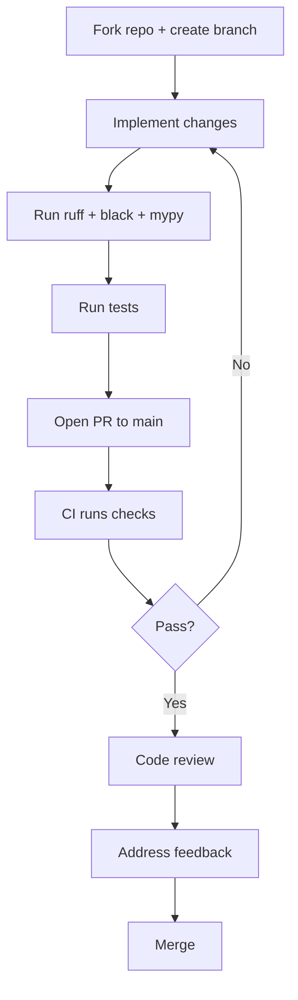

# Contributing to Ciri

Thank you for your interest in making Ciri better. This guide covers how to set up a development environment, the project structure, contribution workflows, and how to extend Ciri with new skills, toolkits, and subagents.

---

## Ways to Contribute

- **Bug reports** — detailed reproduction steps help enormously
- **Documentation improvements** — correct inaccuracies, add examples, expand thin sections
- **New built-in skills** — add a skill to `src/skills/` for the community
- **New subagents** — add specialized agent configs to `src/subagents/`
- **Core improvements** — middleware, CLI, persistence, streaming
- **Tests** — we always need more coverage

---

## Development Setup

### Prerequisites

- Python 3.12+
- [uv](https://docs.astral.sh/uv/) (recommended) or pip
- Git

### Clone and Install

```bash
git clone https://github.com/adimis-ai/ciri.git
cd ciri

# Install with uv (recommended)
uv sync

# Or with pip in a virtualenv
python -m venv .venv
source .venv/bin/activate
pip install -e ".[dev]"
```

### Set Up API Keys

```bash
export ANTHROPIC_API_KEY="sk-ant-..."  # or your preferred provider
```

### Run Ciri

```bash
# Via uv
uv run ciri

# Or directly
python -m src
```

---

## Project Structure

```
ciri/
├── src/
│   ├── __main__.py          # CLI entrypoint, REPL, CiriCompleter
│   ├── agent.py             # Ciri agent class, tool registration, MiddlewareBuilder
│   ├── copilot.py           # create_copilot() — full LangGraph assembly
│   ├── controller.py        # CiriController — stream, run, state management
│   ├── middlewares/         # All custom middleware classes
│   │   ├── memory.py        # MemoryMiddleware
│   │   ├── skills.py        # SkillsMiddleware + bootstrap
│   │   ├── subagents.py     # SubAgentMiddleware
│   │   ├── toolkits.py      # ToolkitInjectionMiddleware
│   │   └── inject_names.py  # InjectAvailable{Tool,SubAgent,Skill}NamesMiddleware
│   ├── subagents/           # Built-in subagent implementations
│   │   ├── trainer_agent.py
│   │   ├── skill_builder.py
│   │   ├── toolkit_builder.py
│   │   ├── subagent_builder.py
│   │   └── web_researcher.py
│   ├── toolkit/             # Built-in tools
│   │   ├── web_crawler_tool.py
│   │   ├── script_executor_tool.py
│   │   └── human_follow_up_tool.py
│   ├── skills/              # Built-in skill packages (SKILL.md per skill)
│   └── utils.py             # Shared utilities, harness dir helpers, autocomplete discovery
├── docs-site/               # Docusaurus documentation site
├── tests/                   # Test suite
└── pyproject.toml           # Build config, dependencies
```

---

## Code Style

We use **ruff** for linting and **black** for formatting:

```bash
# Lint (with auto-fix)
ruff check src/ --fix

# Format
black src/

# Type check
mypy src/
```

Run these before every commit. CI will reject PRs that fail linting or type checks.

---

## Testing

```bash
# Run all tests
pytest

# Run with coverage
pytest --cov=src --cov-report=term-missing

# Run a specific test file
pytest tests/test_middlewares.py
```

When adding new functionality:
- Write unit tests for pure functions and utilities
- Write integration tests that call `create_copilot()` with a mock input and assert stream behavior
- Use `controller.get_state()` and `controller.run()` with `serialize=True` for snapshot tests

---

## PR Workflow



1. **Fork** the repository and create a feature branch from `main`:
   ```bash
   git checkout -b feature/my-feature
   ```

2. **Make your changes** — keep commits focused and atomic.

3. **Run checks locally:**
   ```bash
   ruff check src/ --fix && black src/ && mypy src/ && pytest
   ```

4. **Open a PR** to `main` with a clear description of:
   - What problem this solves
   - How it was implemented
   - How to test it

5. **CI will run** linting, type checks, and tests automatically.

6. **Address review comments** — maintainers aim to review within a week.

### Commit Message Convention

Use conventional commits:

```
feat: add @harness: autocomplete trigger
fix: prevent ToolRetryMiddleware from retrying GraphInterrupt
docs: expand HITL security guide
refactor: extract harness discovery into utils.py
test: add integration test for SkillsMiddleware bootstrap
```

---

## Adding a Built-in Skill

1. Create a directory under `src/skills/<skill-name>/`
2. Add a `SKILL.md` with YAML frontmatter:
   ```markdown
   ---
   name: skill-name
   description: Use this skill when... [trigger conditions]. Handles [capabilities].
   license: MIT
   ---
   # Skill Name Guide
   [Playbook instructions]
   ```
3. Include any supporting reference files (`REFERENCE.md`, `FORMS.md`, etc.)
4. Test by running Ciri — `SkillsMiddleware` bootstraps from `src/skills/` on first run
5. Open a PR with the new skill directory

**Quality bar for built-in skills:**
- `description` must be trigger-condition-oriented (not a feature list)
- Playbook must be actionable with concrete examples
- No dependencies on private/internal APIs
- Include a license compatible with the project

---

## Adding a Built-in Subagent

1. Add implementation to `src/subagents/<subagent-name>.py`
2. Register in `src/copilot.py` alongside the other builder subagents
3. If it needs a YAML config template, add it to the appropriate location
4. Add tests that verify the subagent builds and produces valid output

---

## Adding a Middleware

1. Extend `AgentMiddleware` from the deepagents library:
   ```python
   from langchain.agents.middleware import AgentMiddleware

   class MyMiddleware(AgentMiddleware):
       def wrap_model_call(self, request, handler):
           request.system_prompt += "\n\nMy injected context"
           return handler(request)
   ```
2. Register in `create_copilot()` in `src/copilot.py`
3. Add documentation in `docs-site/docs/internals/middlewares.md`
4. Add tests covering the middleware's behavior in isolation

---

## Documentation

The docs site lives in `docs-site/` (Docusaurus 3). To run locally:

```bash
cd docs-site
npm install
npm start
```

The site will be at `http://localhost:3000`. Hot-reload is enabled.

**Documentation standards:**
- Write from Ciri's perspective — "Ciri does X" not "the system does X"
- Include Mermaid diagrams for architecture and sequence flows
- Keep individual pages under 300 lines
- Link to source files (e.g., `src/middlewares/skills.py`) for accuracy
- Every new feature needs a corresponding docs page before merge

---

## Reporting Bugs

When opening a bug report, include:

1. **Steps to reproduce** — minimal, exact steps
2. **Expected behavior** — what should happen
3. **Actual behavior** — what actually happens, including any error output
4. **Environment:**
   - OS and version
   - Python version (`python --version`)
   - Ciri version (`pip show ciri`)
   - Model provider and model name
5. **Logs** — relevant lines from the terminal output

Use GitHub Issues: [github.com/adimis-ai/ciri/issues](https://github.com/adimis-ai/ciri/issues)

---

## Code of Conduct

Be respectful. We're building something useful together. Harassment, discrimination, or bad-faith arguments are not welcome.
