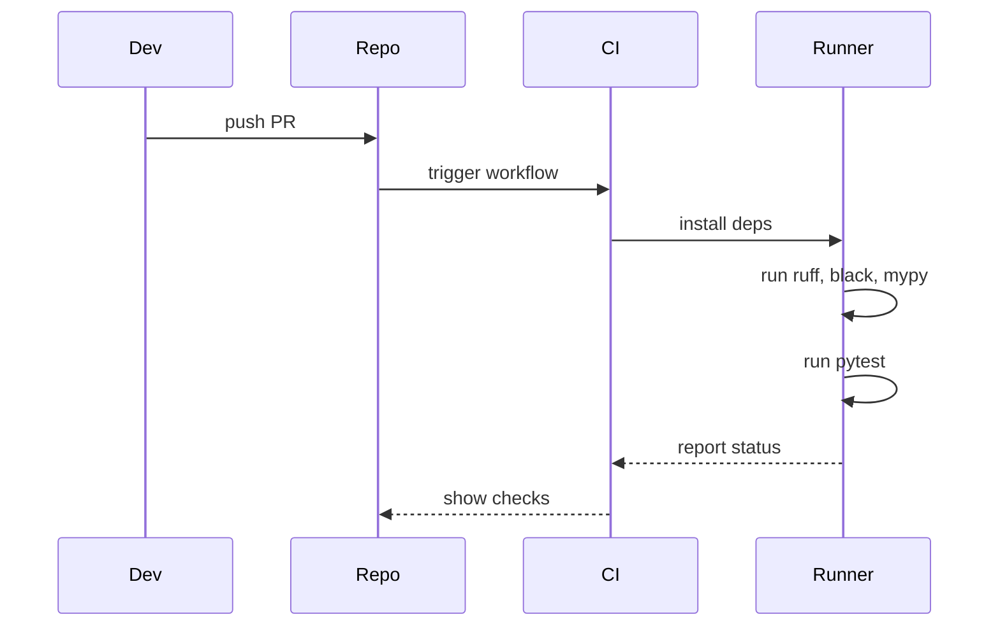

# Tests & Linting

Testing
- Run unit tests with pytest:

  pytest

- Async tests: pytest-asyncio is available
- Coverage: pytest --cov=src

Linting & Formatting
- Ruff (fast linter):

  ruff check src/
  ruff check src/ --fix

- Black (formatter):

  black src/

- Mypy (type checking):

  mypy src/

Pre-PR checklist (recommended):
- ruff check --fix
- black --check src/
- pytest

CI pipelines should run the same commands to ensure consistency.

---

## Typical CI job flow

