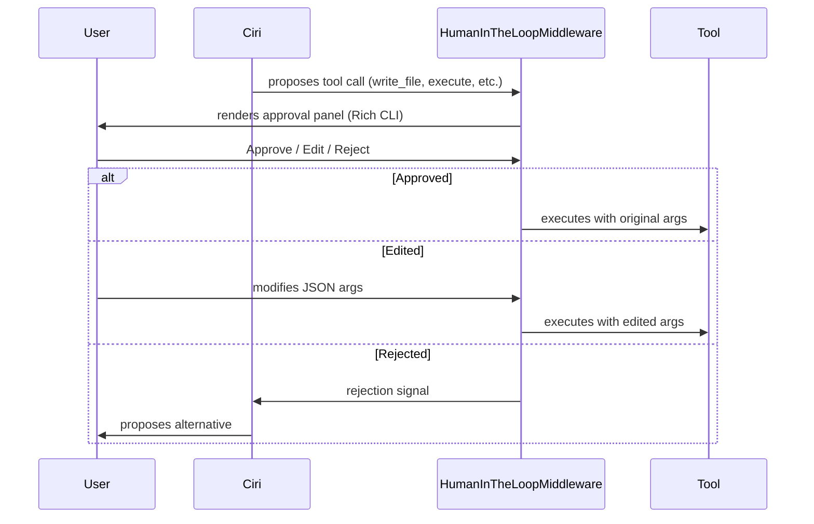

# Human-in-the-Loop (HITL)

Ciri's Human-in-the-Loop system is a **mandatory safety gate** built into the `HumanInTheLoopMiddleware` at the LangGraph level. Before Ciri executes any consequential action — writing a file, running a script, calling an external service — she pauses and presents a richly formatted approval prompt. You inspect, approve, edit, or reject every proposed action.

---

## How HITL Works



---

## Default Interrupt Triggers

These tool calls require approval by default. The list is configured in `create_copilot()` in `src/copilot.py`:

| Tool | When It Fires |
|---|---|
| `execute` | Any shell command |
| `edit_file` | Modifying an existing file |
| `write_file` | Creating a new file |

---

## The Approval Panel

When Ciri wants to take an action, you see a panel like this in the terminal:

```
╔══════════════════════════════════════════════════════════╗
║  🔒 Tool Execution Approval Required                      ║
╠══════════════════════════════════════════════════════════╣
║  ⚙️  write_file                                           ║
║  Write content to a file at the given path               ║
║                                                          ║
║  {                                                       ║
║    "path": "src/services/billing.py",                    ║
║    "content": "import stripe\n..."                       ║
║  }                                                       ║
╠══════════════════════════════════════════════════════════╣
║  [1] Approve    [2] Edit args    [3] Reject              ║
╚══════════════════════════════════════════════════════════╝
```

### Response Options

**1 — Approve**: Ciri executes exactly as proposed. This is the most common response when the plan looks correct.

**2 — Edit**: The panel enters edit mode, showing the raw JSON arguments. You modify them directly — for example, changing a file path, adjusting a command, or redacting sensitive data. After saving, Ciri validates the JSON and executes with your modified args.

**3 — Reject**: Ciri does not execute. She receives a rejection signal and typically proposes an alternative approach in her next message.

---

## Script Execution Approval

The `execute_script` tool (sandboxed Python/JavaScript runner) has an extended approval panel that shows:

- **Syntax-highlighted script content** — see exactly what will run
- **Language** — Python or JavaScript
- **Dependencies** — packages to be installed in the isolated venv
- **Working directory** — where the script runs
- **Output directory** — where results are written
- **Timeout** — maximum execution time
- **Cleanup** — whether the venv is deleted after execution

```
╔══════════════════════════════════════════════════════════╗
║  📜 Script Execution Approval                             ║
╠══════════════════════════════════════════════════════════╣
║  Language: Python                                        ║
║  Dependencies: pandas, openpyxl                          ║
║  Timeout: 120s  |  Cleanup: true                         ║
╠══════════════════════════════════════════════════════════╣
║  import pandas as pd                                     ║
║  df = pd.read_excel("data.xlsx")                         ║
║  summary = df.describe()                                 ║
║  summary.to_csv("output/summary.csv")                    ║
╠══════════════════════════════════════════════════════════╣
║  [1] Approve    [2] Reject                               ║
╚══════════════════════════════════════════════════════════╝
```

→ [Script Executor Guide](script-executor.md)

---

## Clarification Interrupts

Sometimes Ciri is uncertain about your intent and stops to ask a clarifying question before acting. These **human_follow_up** interrupts look different from tool approval prompts:

```
╔══════════════════════════════════════════════════════════╗
║  ❓ Clarification Needed                                  ║
╠══════════════════════════════════════════════════════════╣
║  Should I update all environments or only production?    ║
║                                                          ║
║  1. Update production only                               ║
║  2. Update all environments (staging + production)       ║
║  3. Show me a diff first                                 ║
╚══════════════════════════════════════════════════════════╝
You >
```

Type the number of your choice or enter your own free-text response.

---

## `all_allowed` Mode

For automated pipelines or CI environments where you trust Ciri fully, you can disable HITL:

```python
graph = await create_copilot(all_allowed=True)
```

:::warning
`all_allowed=True` removes ALL approval gates. Only use this in fully controlled, sandboxed environments where you own the input stream entirely.
:::

---

## Customizing Interrupt Triggers

You can configure which tools trigger HITL when building a custom Ciri instance:

```python
graph = await create_copilot(
    interrupt_on={
        "execute": True,
        "edit_file": True,
        "write_file": True,
        "send_email": True,          # custom tool
        "update_crm": {              # InterruptOnConfig: custom conditions
            "when": "always"
        },
    }
)
```
