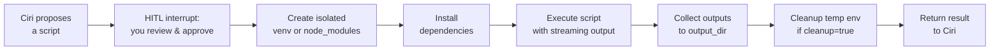

# Script Executor

The `execute_script` tool gives Ciri the ability to run arbitrary Python or JavaScript code in a **fully isolated, sandboxed environment** — with your explicit approval before anything runs. It handles dependency installation, execution, output collection, and cleanup automatically.

---

## What It Does



---

## When Ciri Uses It

Ciri reaches for `execute_script` when a task requires:

- **Python data processing** — pandas, numpy, scipy, matplotlib
- **Browser automation** — Playwright, Selenium (auto-installs Playwright chromium if needed)
- **File generation** — producing CSVs, Excel files, images, PDFs as output
- **Package-specific operations** — anything requiring a library not already installed
- **Isolated computation** — avoiding side effects on the host environment

---

## The Approval Prompt

Before anything runs, you see a Rich-rendered approval panel:

```
╔══════════════════════════════════════════════════════════════╗
║  📜 Script Execution Approval                                 ║
╠══════════════════════════════════════════════════════════════╣
║  Language: python        Timeout: 120s   Cleanup: yes        ║
║  Dependencies: pandas, openpyxl                               ║
║  Working dir: /home/user/projects/my-startup                  ║
║  Output dir:  /home/user/projects/my-startup/output           ║
╠══════════════════════════════════════════════════════════════╣
║  import pandas as pd                                          ║
║  import openpyxl                                              ║
║                                                               ║
║  df = pd.read_excel("data/q1_sales.xlsx")                    ║
║  summary = df.groupby("region")["revenue"].sum()              ║
║  summary.to_csv("output/revenue_by_region.csv")              ║
║  print(summary.to_string())                                   ║
╠══════════════════════════════════════════════════════════════╣
║  [1] Approve    [2] Reject                                    ║
╚══════════════════════════════════════════════════════════════╝
```

You see the **full script**, dependencies, working directory, and where outputs will be saved — before a single line of code runs.

---

## Input Parameters

| Parameter | Type | Default | Description |
|---|---|---|---|
| `script_content` | string | required | Full source code of the script |
| `language` | `"python"` or `"javascript"` | required | Execution runtime |
| `dependencies` | list[string] | `[]` | pip or npm packages to install |
| `working_dir` | string | current dir | Where the script runs |
| `output_dir` | string | `None` | Directory for persistent outputs |
| `timeout` | int | `120` | Max execution time in seconds |
| `cleanup` | bool | `True` | Delete temp venv/node_modules after run |

---

## Isolation Model

**Python scripts** run in a fresh temporary venv created for each execution:
```bash
python -m venv /tmp/ciri-script-XXXXX
/tmp/ciri-script-XXXXX/bin/pip install <dependencies>
/tmp/ciri-script-XXXXX/bin/python script.py
```

**JavaScript scripts** run in a temporary `node_modules` environment:
```bash
npm init -y
npm install <dependencies>
node script.js
```

When `cleanup=True` (default), the temp environment is deleted after execution. When `cleanup=False`, the environment is preserved for debugging.

---

## Output Preservation

If `output_dir` is specified, any files written there during execution are **preserved after cleanup**. This is how Ciri delivers generated artifacts (CSV exports, charts, processed documents) to your workspace.

```
Ciri generates a report → writes to /tmp/ciri-XXXXX/output/ →
copies to output_dir → deletes /tmp/ciri-XXXXX →
output_dir remains with your files
```

---

## Playwright Special Handling

If `playwright` is in the `dependencies` list, the script executor automatically runs `playwright install chromium` after installing the package — ensuring browser automation works in the isolated environment without manual intervention.

---

## Output Streaming

Script output (stdout and stderr) streams line-by-line back to the terminal in real time, so you can monitor long-running scripts:

```
Ciri > Running script...
  [stdout] Processing 10,000 rows...
  [stdout] Region analysis complete
  [stdout] Writing output/revenue_by_region.csv
  [stdout] Done in 3.2s
```

---

## Security Boundaries

- The script runs as your user — same permissions as the terminal
- The working directory is scoped to `working_dir` (defaults to your workspace root)
- Network access is unrestricted (scripts can make HTTP requests)
- File access is unrestricted within the working directory
- The sandboxing is isolation via venv — **not** a kernel-level container

The Human-in-the-Loop approval is the primary safety gate: **review the script carefully before approving**, particularly if it performs network requests or file writes outside the output directory.
