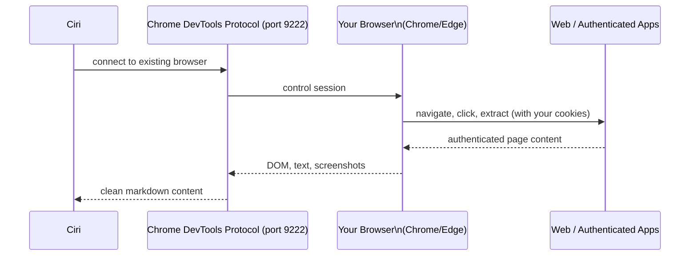

# Deep Web Research

Ciri's `web_researcher` subagent is not a basic scraper. It operates your **real browser** via Chrome DevTools Protocol (CDP), using your actual sessions, cookies, and login state. This means Ciri can research inside authenticated apps — your company's internal wiki, AWS console, GitHub private repos, Salesforce, Google Analytics — anywhere your browser is already logged in.

---

## How Browser Integration Works



**Key benefits of real browser access:**
- Your cookies and sessions are already active — no re-authentication
- JavaScript-heavy SPAs render correctly (React, Angular, Vue apps)
- You can access private GitHub repos, internal tools, VPN-restricted resources
- Anti-bot detection is minimized — you're using a real browser, not a headless scraper

---

## Enabling Browser Integration

Ciri needs your browser running with remote debugging enabled. On startup, Ciri attempts to detect and connect automatically. If the connection fails, you'll see:

```
⚠ CDP port 9222 did not open — web browsing tools will be unavailable
  Start Chrome with --remote-debugging-port=9222 to enable authenticated research
```

### Linux / macOS

```bash
google-chrome --remote-debugging-port=9222 &
# or
/Applications/Google\ Chrome.app/Contents/MacOS/Google\ Chrome --remote-debugging-port=9222 &
```

### Windows

```powershell
& "C:\Program Files\Google\Chrome\Application\chrome.exe" --remote-debugging-port=9222
```

### Edge

```bash
msedge --remote-debugging-port=9222 &
```

After launching, **restart Ciri** — it will detect the CDP port and connect.

---

## Browser Profile Management

Chrome v136+ blocks CDP connections to the default profile directory for security. Ciri handles this automatically by:

1. Detecting your browser profiles via `detect_browser_profiles()`
2. Copying the selected profile to a Ciri-managed directory
3. Launching from the copied directory (exempt from Chrome's CDP restriction)

You can switch browser profiles at any time:

```
You > /change-browser-profile
```

Ciri will list all detected profiles with a selection menu.

---

## What the `web_researcher` Can Do

The `web_researcher` subagent has access to:

| Tool | Description |
|---|---|
| `navigate_browser` | Navigate to a URL with network-idle waiting (SPA-friendly) |
| `extract_text` | Get visible text from the current page |
| `click_element` | Click any element by CSS selector |
| `type_text` | Type in focused input |
| `screenshot` | Capture a full-page screenshot |
| `web_crawler` | High-performance BFS crawl of multi-page sites |
| DuckDuckGo search | Find URLs for a query without browser navigation |

**Typical research workflow:**

```
You > Research the top 5 competitors' pricing pages and summarize their tier structures

Ciri > Delegating to web_researcher...
       → Searching DuckDuckGo for "[company] pricing 2026"
       → Navigating to competitor-a.com/pricing
       → Extracting pricing table content...
       → Navigating to competitor-b.com/pricing
       [continues for each competitor]
       → Synthesizing comparison table
```

---

## Without a Browser (Static Crawling)

Ciri can still perform web research without an open browser using `web_crawler` alone:

- **Static pages**: crawl4ai fetches and converts to clean markdown
- **Deep site crawling**: BFS traversal up to configurable depth and page count
- **Cache support**: repeated crawls use cached content for speed

The limitation: no authentication, no JavaScript rendering, no session cookies.

---

## Privacy & Safety

- Ciri **only** uses the browser when explicitly delegated to the `web_researcher` subagent
- Browser usage requires HITL approval if configured (tool calls go through `HumanInTheLoopMiddleware`)
- Ciri works with a **copy** of your profile, not the original — your real profile is never modified
- No browsing history or credentials are stored in Ciri's database
- You can revoke access at any time by closing the remote-debugging browser window

---

## Troubleshooting

**"CDP port 9222 did not open"**
→ Launch Chrome/Edge with `--remote-debugging-port=9222` as shown above.

**"Profile copy failed"**
→ Close all Chrome windows first, then launch fresh with the debugging flag.

**"Page content not loading / empty extraction"**
→ The page may require JavaScript. Ensure you're using the full browser integration (not just the crawler). Confirm Chrome is running with CDP enabled.

**WSL Users**
→ Browser integration is currently unavailable in WSL environments (no display server). Use the static `web_crawler` tool instead, or run Ciri natively on Windows/Linux.
