# CIRI — Contextual Intelligence and Reasoning Interface

**Ciri** is an open-source, autonomous AI copilot that lives *inside your workspace*. She is not a coding assistant — she is a general-purpose intelligence that adapts to whatever domain you work in: software engineering, accounting, marketing, branding, sales, legal research, content production, data analysis, or any discipline you train her on.

Ciri builds a deep, persistent understanding of your workspace, connects to your real browser, executes sandboxed scripts, and permanently expands her own capabilities by creating new Skills, Toolkits, and SubAgents — all from a single terminal interface.

---

## Why Ciri?

| Feature | Ciri | Generic AI Chat |
|---|---|---|
| Persistent workspace memory | ✅ Two-level (global + project) | ❌ Stateless |
| Domain-agnostic training | ✅ Any field: dev, finance, marketing… | ❌ General only |
| Self-evolving capabilities | ✅ Builds her own tools | ❌ Fixed toolset |
| Real browser integration (CDP) | ✅ Your sessions & cookies | ❌ Scrapers only |
| Human-in-the-loop approvals | ✅ Per-action, editable | ❌ All-or-nothing |
| MCP Toolkit ecosystem | ✅ Any standard MCP server | ❌ |
| Local-first, private history | ✅ SQLite on-disk | ❌ Cloud |
| Multi-provider LLM | ✅ OpenAI, Anthropic, OpenRouter… | Varies |

---

## What Can Ciri Do?

Ciri's capabilities are defined by the workspace she inhabits and the training she receives via `/sync`. Examples across domains:

**Software Engineering**: Read codebases, write and test code, manage git, create PRs, run CI pipelines, refactor, document.

**Business Operations**: Draft proposals, analyze financials, automate reporting, manage project trackers, generate slide decks.

**Marketing & Branding**: Research competitors, draft copy, generate visuals, schedule campaigns, analyze engagement data.

**Sales & CRM**: Qualify leads, draft outreach, summarize call notes, update CRM via MCP toolkits, track pipeline.

**Data & Research**: Crawl the web for primary sources using your authenticated browser, summarize papers, build data pipelines.

**Document Work**: Fill PDF forms, process DOCX/PPTX/XLSX files, extract structured data, produce formatted reports.

The key insight: Ciri trains herself to match *your* domain. Run `/sync` in a marketing agency workspace and she learns your brand voice, tools, and workflows. Run it in a fintech codebase and she learns your stack, conventions, and release process.

---

## System Architecture

```mermaid
flowchart TD
  User([👤 User Terminal]) <--> CLI[CIRI CLI\nsrc/__main__.py]
  CLI <--> Controller[CopilotController\nsrc/controller.py]
  Controller <--> Graph[Copilot Graph\nsrc/copilot.py]

  Graph <--> LLM[LLM Providers\nOpenAI · Anthropic · OpenRouter]
  Graph <--> MW[Middleware Stack]
  Graph <--> DB[(Local SQLite\n~/.ciri/data/ciri.db)]

  subgraph MW [Middleware Stack]
    direction LR
    M1[MemoryMiddleware]
    M2[SkillsMiddleware]
    M3[SubAgentMiddleware]
    M4[ToolkitInjectionMiddleware]
    M5[HumanInTheLoopMiddleware]
    M6[TodoListMiddleware]
    M7[InjectNamesMiddleware]
  end

  subgraph Subagents [Specialized Subagents]
    SA1[web_researcher]
    SA2[skill_builder]
    SA3[toolkit_builder]
    SA4[subagent_builder]
    SA5[trainer_agent]
  end

  Graph <--> Subagents

  subgraph Harness [Two-Level Core Harness]
    H1[~/.local/share/ciri/\nGlobal Skills · Toolkits · Memory]
    H2[.ciri/\nProject Skills · Toolkits · Memory]
  end

  MW --> Harness
```



---

## Key Concepts

### Skills
Reusable capability packages that give Ciri domain knowledge and executable tools. A skill is a directory containing a `SKILL.md` (playbook) and a `scripts/` folder of Python helpers. Skills live in the **core harness** (`~/.local/share/ciri/skills/`) for global availability or your **project harness** (`.ciri/skills/`) for workspace-specific ones. Ciri ships with built-in skills for PDF forms, Office documents, web testing, MCP server building, and more.

→ [Skills Guide](skills-guide.md)

### Toolkits (MCP)
Ciri's `ToolkitInjectionMiddleware` is an MCP client that connects to any standard Model Context Protocol server. Ask Ciri to "build a toolkit for Slack" or "connect to my PostgreSQL database" and the `toolkit_builder` subagent generates an MCP server, tests it, and hot-reloads it — no restart required.

→ [Toolkits Guide](toolkits-guide.md)

### SubAgents
Specialized agents with scoped system prompts and tool access. The five built-in subagents (`web_researcher`, `skill_builder`, `toolkit_builder`, `subagent_builder`, `trainer_agent`) handle complex delegated tasks. You can define your own in `.ciri/subagents/` using YAML configuration.

→ [SubAgents Guide](subagents-guide.md)

### Core Harness
A two-level filesystem that separates **global** capabilities (available across all your projects) from **project-specific** ones. The global harness lives in `~/.local/share/ciri/` (Linux) or equivalent OS data dir, and the project harness in `.ciri/` at your workspace root.

→ [Core Harness Architecture](architecture/core-harness.md)

### Self-Evolution
Run `/sync` and the **Trainer Agent** audits your environment, identifies capability gaps, and orchestrates builder subagents to create new Skills, Toolkits, or SubAgents — then hot-reloads them without a restart. The more you use Ciri in a domain, the more specialized she becomes.

→ [Self-Evolution & Training](internals/self-evolution.md)

---

## Quick Start

```bash
# Install
pip install ciri-ai
# or with uv (recommended)
uv tool install ciri-ai
# or add to project
uv add ciri-ai

# Run interactive TUI
ciri

# On first run, Ciri walks you through model selection.
# Then analyze your workspace:
/sync

# Or use API mode for custom UIs / backend servers
ciri --api --server &          # Start persistent server
ciri --api --run --input ...   # Send commands from your backend
```

→ [Full Getting Started Guide](getting-started.md)

---

## Navigation

| Section | What's Inside |
|---|---|
| **[Getting Started](getting-started.md)** | Installation, first run, model configuration |
| **[CLI Reference](cli-reference.md)** | All `/commands`, `@triggers`, keyboard shortcuts, and `--api` mode examples |
| **[API Reference](api-reference.md)** | Programmatic access: Unix socket server, NDJSON protocol, backend integration |
| **[Skills Guide](skills-guide.md)** | Creating and using domain capability packages |
| **[Toolkits Guide](toolkits-guide.md)** | MCP server integration |
| **[SubAgents Guide](subagents-guide.md)** | Delegation and custom agent roles |
| **[Architecture](architecture/overview.md)** | How the graph, middleware, and harness fit together |
| **[Features](features/memory.md)** | Memory, web research, HITL, autocomplete, script executor |
| **[Built-in Skills](built-in-skills/index.md)** | PDF, Office docs, web testing, and more |
| **[Internals](internals/self-evolution.md)** | Graph execution, middlewares, self-evolution deep dive |
| **[Use Cases](use-cases/index.md)** | Real-world walkthroughs across domains |
