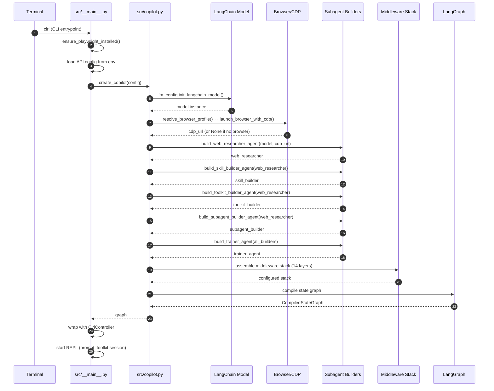
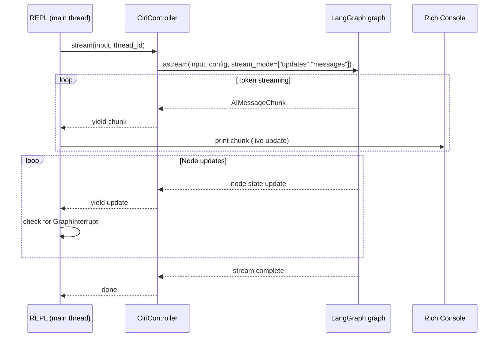

# Graph Execution & Agent Boot

This page traces exactly how Ciri is constructed and executed at runtime — from the moment `ciri` is run in the terminal to the first token streaming back. Reference this when adding middlewares, subagents, or custom tools.

---

## Boot Sequence



---

## Key Entry Points

| Function | File | Purpose |
|---|---|---|
| `main()` | `src/__main__.py` | CLI entry, startup sequence, REPL loop |
| `create_copilot()` | `src/copilot.py` | Assembles the full LangGraph graph |
| `CopilotController.run()` | `src/controller.py` | Streams events from graph for a given input |
| `CopilotController.get_state()` | `src/controller.py` | Returns current graph checkpoint state |
| `llm_config.init_langchain_model()` | `src/llm_config.py` | Initializes LangChain model from config |
| `ensure_playwright_installed()` | `src/__main__.py` | Runs `playwright install chromium` silently |

---

## LangGraph State Graph

Ciri uses a `StateGraph` compiled with:

- **State schema** — typed state dict carrying messages, checkpoints, and metadata
- **Nodes** — the main Ciri agent node + tool execution nodes
- **Edges** — conditional routing based on whether the LLM called a tool or finished
- **Checkpointers** — `AsyncSqliteSaver` backed by `~/.ciri/data/ciri.db` for persistence across sessions

The graph runs in **streaming mode** using `astream()` with two streaming modes:

```python
stream_modes = ["updates", "messages"]
```

- `"updates"` — emits node state after each graph step; carries interrupt signals
- `"messages"` — emits `AIMessageChunk` objects for token-by-token streaming

---

## [Full Middleware Reference](../internals/middlewares.md) | [Controller Reference](controller.md)
## Middleware Wrapping

Each middleware wraps the LLM call via `wrap_model_call`. The stack processes requests inward and responses outward:

```
User input
  → InjectNamesMiddleware     (inject tool/skill/subagent registries)
  → MemoryMiddleware          (inject memory files)
  → SkillsMiddleware          (inject active skill context)
  → SubAgentMiddleware        (inject subagent routing logic)
  → ToolkitInjectionMiddleware (connect MCP servers)
  → HumanInTheLoopMiddleware  (intercept for approval)
  → TodoListMiddleware        (inject task state)
  → LLM call
  → ToolRetryMiddleware       (retry failed tools, skip GraphInterrupt)
  → PatchToolCallsMiddleware  (normalize tool call format)
  → Response
```

Middlewares are assembled in `create_copilot()` via `MiddlewareBuilder`. The order is significant — middlewares added first wrap the outermost layer.

---

## Interrupt Handling

When `HumanInTheLoopMiddleware` triggers, it raises `GraphInterrupt`. This exception surfaces through `astream()` as a special event type:

```python
async for event in graph.astream(input, config, stream_mode=["updates", "messages"]):
    if isinstance(event, GraphInterrupt):
        # Surface approval prompt to user
        handle_interrupts(event)
```

After the user responds (approve/edit/reject), execution resumes with:

```python
await graph.astream(Command(resume=decision), config)
```

`ToolRetryMiddleware` is configured with `retry_on=lambda exc: not isinstance(exc, GraphInterrupt)` to prevent retrying approval prompts.

---

## Thread State and Persistence

Each conversation thread maps to a LangGraph **config** with a unique `thread_id`:

```python
config = {"configurable": {"thread_id": thread_id}}
```

LangGraph's `AsyncSqliteSaver` checkpointer writes the full state (messages + metadata) to `~/.ciri/data/ciri.db` after each graph step. Resuming a thread replays from the latest checkpoint.

The `threads` table in the same database stores human-readable metadata (name, created_at, last_updated) alongside the LangGraph checkpoint data.

---

## Streaming Architecture in the CLI



The REPL runs a synchronous loop calling `controller.run()`. `CopilotController.run()` runs the async `astream()` in the event loop and yields events.

---

## Adding a New Tool

1. Define the tool function with LangChain `@tool` decorator:

   ```python
   from langchain.tools import tool

   @tool
   def my_new_tool(input: str) -> str:
       """One-sentence description of what this tool does."""
       return f"Result: {input}"
   ```

2. Register it in `src/agent.py` inside `_create_ciri()`:

   ```python
   tools = [
       ...existing tools...,
       my_new_tool,
   ]
   ```

3. If the tool needs HITL approval, add it to `interrupt_on`:

   ```python
   interrupt_on = {"execute": True, "edit_file": True, "write_file": True, "my_new_tool": True}
   ```

4. The `InjectAvailableToolNamesMiddleware` will automatically include it in the registry injection on the next run.

---

## Adding a New Subagent

See the full [Subagents Guide](../subagents-guide.md). At the graph level:

1. Implement the builder function (e.g., `build_my_subagent()`) in `src/subagents/my_subagent.py`
2. Register in `create_copilot()` alongside the other builder calls
3. Pass it to `SubAgentMiddleware` so Ciri can delegate to it
4. `InjectAvailableSubAgentNamesMiddleware` will automatically include it in the name injection

---

## Practical Debugging Tips

**Trace graph compilation:**
```python
# In a test or scratch script
import asyncio
from src.copilot import create_copilot

graph = asyncio.run(create_copilot(...))
print(graph.get_graph().draw_ascii())
```

**Inspect checkpoint state:**
```python
from src.controller import CopilotController

ctrl = CopilotController(graph)
state = asyncio.run(ctrl.get_state(thread_id="my-thread"))
print(state.values)
```

**Integration test pattern:**
```python
import asyncio
from src.copilot import create_copilot
from src.controller import CiriController

async def test_basic_flow():
    graph = await create_copilot(model="claude-haiku-4-5-20251001")
    ctrl = CopilotController(graph)
    thread_id = "test-thread"

    results = []
    async for event in ctrl.run("Hello", thread_id):
        results.append(event)

    assert any("Hello" in str(r) for r in results)
```
