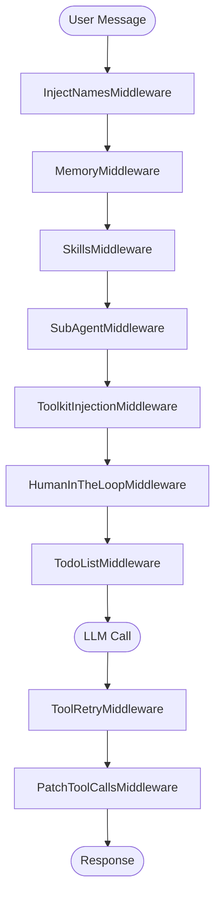

# Middleware Stack

Ciri's intelligence is not monolithic — it is assembled from a layered middleware stack that transforms every agent turn. Each middleware wraps the LLM call to inject context, enforce safety, manage state, or add capabilities.

---

## Overview



Middlewares are composed in `src/copilot.py` via `create_copilot()`.

---

## Middleware Reference

### 1. `MemoryMiddleware`
**Source**: `src/middlewares/memory.py`

Injects all `.md` files from the two-level memory system into the system prompt on every turn.

**Load order** (additive — both are injected):
1. `~/.local/share/ciri/memory/` — cross-project global memory
2. `.ciri/memory/` — this workspace's memory (AGENT.md, architecture.md, etc.)

Ciri is instructed to read `.ciri/memory/AGENT.md` at the start of complex tasks — it is the workspace index. After significant work, Ciri updates these files to maintain continuity across sessions.

---

### 2. `SkillsMiddleware`
**Source**: `src/middlewares/skills.py`

Discovers skill packages from the two-level harness and dynamically injects their tools into Ciri's toolset.

**Discovery order**:
1. Core harness skills (`~/.local/share/ciri/skills/`)
2. Project harness skills (`.ciri/skills/`)

On first startup, `_bootstrap_default_skills()` copies bundled skills from `src/skills/` into the core harness. If a skill name exists in both harness levels, the core harness version takes precedence.

Skills are **hot-reloaded** — adding a new skill folder and running `/sync` registers it immediately without restart.

---

### 3. `SubAgentMiddleware`
**Source**: `src/middlewares/subagents.py`

Manages a registry of specialized subagents and enables delegation. When Ciri determines that a task fits a subagent's role, she hands off the request.

**Discovery order**:
1. Core harness subagents (`~/.local/share/ciri/subagents/*.yaml`)
2. Project harness subagents (`.ciri/subagents/*.yaml`)

Deduplication is by **file stem** — a core harness file named `researcher.yaml` prevents a project file `researcher.yaml` from registering.

Built-in subagents (web_researcher, skill_builder, toolkit_builder, subagent_builder, trainer_agent) are always registered as compiled subagents regardless of config files.

---

### 4. `ToolkitInjectionMiddleware`
**Source**: `src/middlewares/toolkits.py`

Acts as an MCP client that discovers and connects to MCP servers. Injects the MCP server's tools into Ciri's toolset dynamically, enabling hot-swap without restart.

**Discovery order** (ordered dict, first-wins):
1. Core harness toolkits (`~/.local/share/ciri/toolkits/`)
2. Project harness toolkits (`.ciri/toolkits/`)

Each toolkit directory contains a manifest and the MCP server process configuration. The middleware spawns the server subprocess and registers its tools into the active toolset.

---

### 5. `HumanInTheLoopMiddleware`
**Source**: `langchain.agents.middleware` (deepagents library)

The mandatory safety gate. Intercepts configured tool calls before execution and issues a `GraphInterrupt` that surfaces as an approval prompt in the CLI.

Default interrupt triggers: `execute`, `edit_file`, `write_file`.

The interrupt payload includes the tool name, description, and full JSON arguments — displayed as a Rich panel with syntax highlighting.

→ [HITL Guide](../features/hitl.md)

---

### 6. `TodoListMiddleware`
**Source**: `langchain.agents.middleware` (deepagents library)

Maintains a structured to-do list across a multi-step task. Before each LLM call, injects the current task state into the context so Ciri can plan and track progress through complex, long-running jobs.

Particularly useful for `/sync` runs (which may involve dozens of steps) and long coding sessions.

---

### 7. `InjectAvailableToolNamesMiddleware`
**Source**: `src/middlewares/inject_names.py`

Injects a formatted list of ALL currently available tool names into the system prompt. This is critical for the subagent builder — when creating a new subagent config, Ciri needs to know what tools exist so she can assign the right ones.

Injection format:
```
# REGISTRY OF AVAILABLE TOOLS
CRITICAL: You MUST ONLY select tools from the following list...

- **write_file**: Write content to a file at the given path
- **execute**: Execute a shell command
- **web_crawler**: High-performance web crawler for extracting markdown...
...
```

Prevents duplicate injection across retries (checks for header before injecting).

---

### 8. `InjectAvailableSubAgentNamesMiddleware`
**Source**: `src/middlewares/inject_names.py`

Injects a list of all currently registered subagent names into the system prompt. Ensures Ciri's routing decisions reference only subagents that actually exist.

---

### 9. `InjectAvailableSkillNamesMiddleware`
**Source**: `src/middlewares/inject_names.py`

Injects a list of all loaded skill names. Helps Ciri avoid attempting to use skills that aren't loaded yet and also informs the trainer agent what already exists before proposing new skills.

---

### 10. `ToolRetryMiddleware`
**Source**: `langchain.agents.middleware` (deepagents library)

Wraps tool calls in a retry loop with configurable retry count and backoff. By default, retries up to 3 times on tool execution failures.

**Critical behavior**: Uses `retry_on=lambda exc: not isinstance(exc, GraphInterrupt)` — HITL interrupts are never retried. This prevents the bug where Ciri would retry 3 times before failing on an approval prompt.

---

### 11. `PatchToolCallsMiddleware`
**Source**: `deepagents.middleware.patch_tool_calls` (deepagents library)

Normalizes tool call formats for consistency across different LLM providers. Different models (OpenAI, Anthropic, etc.) may produce tool call payloads in slightly different schemas — this middleware normalizes them before they hit the tool execution layer.

---

### 12. `FilesystemMiddleware`
**Source**: `deepagents.middleware.filesystem` (deepagents library)

Provides scoped, safe filesystem access. Injects the workspace root path and constrains all file operations to the configured root unless explicitly overridden. Adds `read_file`, `write_file`, `edit_file`, `list_dir`, and related tools.

---

### 13. `SummarizationMiddleware`
**Source**: `deepagents.middleware.summarization` (deepagents library)

Monitors context length and proactively summarizes long conversation threads when they approach the model's context window limit. Preserves critical information while compressing verbose tool outputs.

---

### 14. `AnthropicPromptCachingMiddleware`
**Source**: `langchain_anthropic.middleware`

When using Anthropic models, this middleware automatically applies prompt caching markers to static portions of the system prompt (base instructions, memory, skill lists). Dramatically reduces token cost and latency for long sessions.

---

## Adding Custom Middleware

Extend `AgentMiddleware` from the deepagents library:

```python
from langchain.agents.middleware import AgentMiddleware

class MyCustomMiddleware(AgentMiddleware):
    def wrap_model_call(self, request, handler):
        # Modify request before LLM call
        request.system_prompt += "\n\nMy custom context..."
        response = handler(request)
        # Post-process response
        return response
```

Then pass it to `create_copilot()`:

```python
graph = await create_copilot(
    middleware=[MyCustomMiddleware()]
)
```
