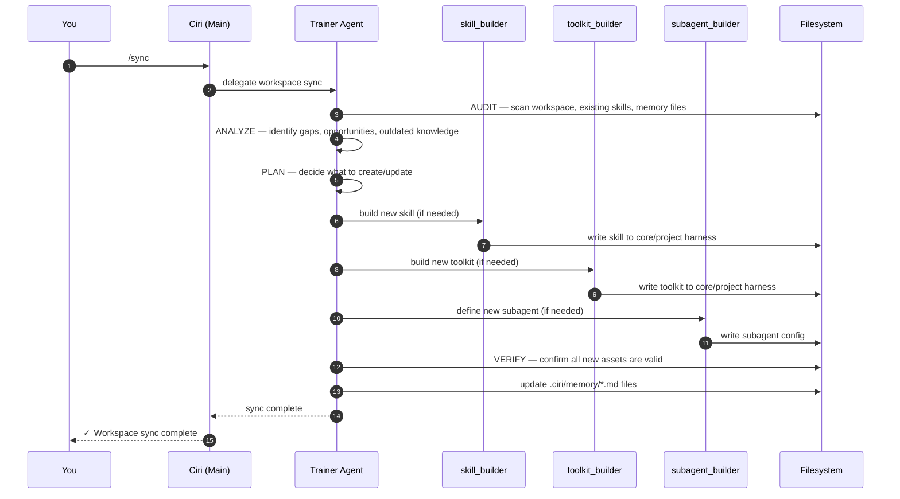

# Self-Evolution & Training

Ciri is designed to become a better version of herself over time — specialized for your exact workspace rather than remaining a generic assistant. The `/sync` command triggers the **Trainer Agent**, which orchestrates a structured AUDIT → ANALYZE → PLAN → BUILD → VERIFY loop.

---

## Overview

When you run `/sync`:



---

## The Five Phases

### 1. AUDIT

The Trainer Agent uses `list_dir`, `read_file`, and `execute` to survey:

- **Project root** — directory structure, file types, technology stack markers (`pyproject.toml`, `package.json`, `Cargo.toml`, etc.)
- **Existing memory** — reads `~/.local/share/ciri/memory/` and `.ciri/memory/` to understand what's already known
- **Existing skills** — reads `SKILL.md` from both harness levels to catalog active capabilities
- **Existing toolkits** — checks toolkit manifests in both harnesses
- **Recent interaction history** — reviews any notes Ciri has made about limitations or recurring patterns

### 2. ANALYZE

Based on the audit, the Trainer Agent identifies:

- **Knowledge gaps** — things the workspace does that Ciri doesn't know about yet
- **Capability gaps** — tasks that Ciri has been asked to do but lacks a dedicated skill or toolkit for
- **Stale memory** — memory files that reference old module names, deprecated patterns, or outdated conventions
- **New skill opportunities** — recurring workflows that would benefit from a dedicated playbook

### 3. PLAN

The Trainer Agent produces a structured plan:

```
Plan:
1. Update .ciri/memory/architecture.md — auth module was renamed from `auth/` to `authentication/`
2. Create skill: salesforce-pipeline — user asked for this 3x in recent threads
3. Create toolkit: internal-metrics — needs API connection to metrics.internal
4. Create memory file: .ciri/memory/domain.md — workspace is a B2B legal SaaS, no domain file yet
```

### 4. BUILD

For each planned item, the Trainer Agent delegates to the appropriate builder:

| Builder | Creates | Location |
|---|---|---|
| `skill_builder` | `SKILL.md` + supporting files | `~/.local/share/ciri/skills/<name>/` or `.ciri/skills/<name>/` |
| `toolkit_builder` | MCP server manifest + runner | `~/.local/share/ciri/toolkits/<name>/` or `.ciri/toolkits/<name>/` |
| `subagent_builder` | YAML subagent config | `~/.local/share/ciri/subagents/<name>.yaml` or `.ciri/subagents/` |
| Trainer Agent directly | Memory `.md` files | `~/.local/share/ciri/memory/` or `.ciri/memory/` |

By default, new assets go to the **core harness** (`~/.local/share/ciri/`) so they're available across all projects. If the asset is project-specific, it goes to `.ciri/`.

### 5. VERIFY

After building, the Trainer Agent:

- Re-reads each new file to confirm it was written correctly
- Validates YAML frontmatter in `SKILL.md` files
- Confirms toolkit manifests reference valid entry points
- Updates `.ciri/memory/AGENT.md` to index any new capabilities

---

## What Gets Written Where

```
Core harness (~/.local/share/ciri/)     ← cross-project, permanent
├── skills/
│   └── <new-skill>/SKILL.md
├── toolkits/
│   └── <new-toolkit>/manifest.json
├── subagents/
│   └── <new-subagent>.yaml
└── memory/
    └── global-preferences.md

Project harness (.ciri/)                ← this workspace only
└── memory/
    ├── AGENT.md                ← updated by Trainer Agent
    ├── architecture.md         ← updated after refactors
    ├── conventions.md
    ├── domain.md               ← business context
    └── workflows.md
```

---

## Hot-Reload After Sync

After `/sync` completes, Ciri's middleware stack automatically picks up new assets:

- **Skills** — `SkillsMiddleware._refresh_sources()` re-scans both harness levels
- **Toolkits** — `ToolkitInjectionMiddleware` discovers and connects to new MCP servers
- **Subagents** — `SubAgentMiddleware` reloads the subagent registry
- **Memory** — `MemoryMiddleware` re-reads all `.md` files on the next turn

No restart required.

---

## Ciri Self-Updates Between Syncs

The Trainer Agent isn't the only source of memory updates. Ciri is instructed to update memory files autonomously after significant work:

```
Ciri > I've refactored the authentication module. Updating .ciri/memory/architecture.md
       with the new session management approach and module rename.
```

This happens after:
- Large refactors or architectural changes
- New features that affect conventions
- Discovery of important domain concepts during research
- Completion of complex multi-step tasks

---

## Customizing Builder Behavior

The five built-in subagents each have a configurable system prompt:

| Builder | Source | What to Customize |
|---|---|---|
| `trainer_agent` | `src/subagents/trainer_agent.py` | Audit scope, memory file structure, plan format |
| `skill_builder` | `src/subagents/skill_builder.py` | Skill directory structure, playbook format, license |
| `toolkit_builder` | `src/subagents/toolkit_builder.py` | Preferred language (Python vs Node.js), auth patterns |
| `subagent_builder` | `src/subagents/subagent_builder.py` | YAML schema, tool selection logic |
| `web_researcher` | `src/subagents/web_researcher.py` | Source preferences, output format, depth |

To override a builder's behavior for your workspace, create a YAML subagent config in `.ciri/subagents/skill_builder.yaml` — the SubAgent deduplication (by file stem) ensures your project version takes precedence over the core harness version.

---

## Running Sync Manually vs Automatically

**When to run `/sync`:**
- First time you start Ciri in a new project
- After major refactors or architectural changes
- After a rebrand (new domain vocabulary, conventions)
- When you want Ciri to build a new skill or toolkit based on patterns she's observed
- After onboarding new team members who add new patterns to the codebase
