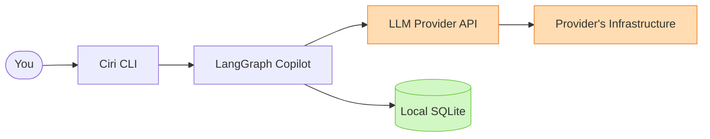

# Security & Privacy

Ciri is designed to be **local-first**: your state lives on your machine, your keys stay in your environment, and you approve every consequential action before it runs. This guide explains the full security model.

---

## What Stays Local

| Data | Where |
|---|---|
| Conversation threads | `~/.ciri/data/ciri.db` |
| LangGraph checkpoints | `~/.ciri/data/ciri.db` |
| Workspace memory files | `.ciri/memory/*.md` |
| Core harness (skills, subagents, toolkits) | `~/.local/share/ciri/` |
| API keys | OS keychain / env vars |
| Browser profile copy | OS temp directory |

Nothing is sent to Adimis servers. There is no telemetry, no account, no cloud sync.

---

## What Goes to the Cloud

When you send a message, Ciri assembles a prompt and sends it to your configured **LLM provider** (Anthropic, OpenAI, Groq, etc.):



**What is sent to the provider:**
- Your message text
- System prompt (base instructions + injected memory + skill context)
- Conversation history up to the context window
- Any file content you explicitly share (via `@files:` or paste)

**What is NOT sent:**
- Files you haven't mentioned or attached
- Your API keys
- Your SQLite database
- Browser session cookies

Review your provider's data retention and privacy policy before sharing sensitive information.

---

## API Key Management

**Best practice:** use environment variables, never hardcoded values.

```bash
# In your shell profile (~/.bashrc, ~/.zshrc)
export ANTHROPIC_API_KEY="sk-ant-..."
export OPENAI_API_KEY="sk-..."
export OPENROUTER_API_KEY="sk-or-..."
```

Ciri reads keys from environment variables at startup. You can also store keys in the OS keychain.

**Never:**
- Commit `.env` files containing keys to version control
- Add keys to `.ciri/memory/` files (they are injected into every prompt)
- Share your `~/.ciri/data/ciri.db` file (it contains full conversation history)

---

## Human-in-the-Loop: The Primary Safety Gate

Every consequential tool call goes through `HumanInTheLoopMiddleware` before execution. This is not optional by default.

**Default interrupt triggers:**

| Tool | Risk |
|---|---|
| `execute` | Runs arbitrary shell commands |
| `edit_file` | Modifies files on disk |
| `write_file` | Creates or overwrites files |

When triggered, Ciri pauses and shows a Rich approval panel:

```
╭─────────────────────────────────────────────╮
│  🔒 Tool Execution Approval Required         │
│                                              │
│  ⚙️  execute                                  │
│  Run a shell command                         │
│                                              │
│  {                                           │
│    "command": "rm -rf ./old-reports/",       │
│    "cwd": "/home/user/workspace"             │
│  }                                           │
│                                              │
│  [a] Approve  [e] Edit args  [r] Reject      │
╰─────────────────────────────────────────────╯
```

You inspect the exact arguments before anything runs. You can edit the JSON or reject the call entirely.

**Script execution** (`execute_script`) also requires approval, showing the full script content, language, dependencies, and output directory.

---

## Filesystem Safety

Ciri's filesystem tools (`read_file`, `write_file`, `edit_file`, `list_dir`) are provided by `FilesystemMiddleware`, which scopes all file access to the workspace root by default.

- Tools cannot path-traverse outside the configured root without explicit override
- `write_file` and `edit_file` require HITL approval before any write occurs
- Toolkit MCP servers run as isolated subprocesses; their filesystem access depends on their own implementation

**Recommendation:** Configure toolkit servers to use allowlists for filesystem access (only the directories they need).

---


---

## Browser Profile Safety (CDP)

Ciri's web research uses Chrome DevTools Protocol on port 9222. When connecting to a browser:

1. Ciri copies your selected Chrome profile to a **temporary directory**
2. Launches Chrome pointing at the temp directory with `--remote-debugging-port=9222`
3. The original profile is never modified
4. The temporary profile directory is cleaned up on exit

This design complies with Chrome v136+'s enforcement of unique `--user-data-dir` for remote-debug sessions and prevents cross-contamination between your regular browsing and Ciri's browser sessions.

**Note:** The temp profile copy contains your cookies and login state for that profile. Do not share temp directories or inspect them for credentials.

---

## Third-Party Dependencies

Ciri's dependency surface is broad. Recommended practices:

```bash
# Audit installed packages for known vulnerabilities
pip-audit

# Keep dependencies current
uv sync --upgrade
```

Key dependency families and their trust implications:

| Package | Purpose | Network access? |
|---|---|---|
| `langchain-*` | LLM orchestration | Yes (provider APIs) |
| `langgraph` | Agent graph execution | No |
| `playwright` | Browser automation | Yes (target sites) |
| `crawl4ai` | Web crawling | Yes (target sites) |


Toolkit MCP servers may introduce additional dependencies. Review their `requirements.txt` or `package.json` before installing.

---

## Reporting Security Issues

Found a vulnerability? Please report it responsibly:

1. **Do not** open a public GitHub issue for security bugs
2. Email the maintainer directly or use GitHub's private vulnerability reporting
3. Include: description, steps to reproduce, affected version, and potential impact
4. Allow reasonable time for a fix before public disclosure

See [Contributing](contributing.md) for the general project contact points.
