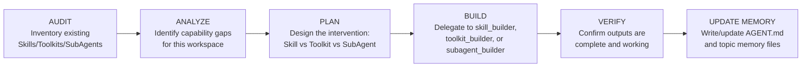
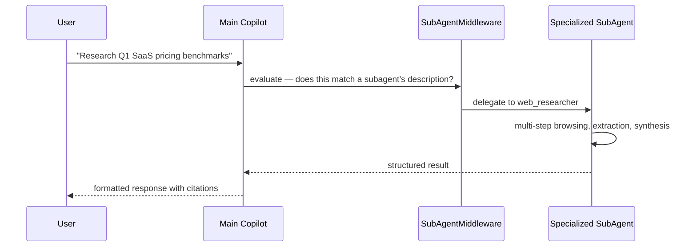

# SubAgents & Delegation

SubAgents are **specialized agent instances** with their own system prompt, tool scope, and reasoning context. Where Ciri is a generalist, a subagent is an expert called in for a specific class of task. The `SubAgentMiddleware` manages routing, handoff, and result integration.

---

## Built-in SubAgents

CIRI ships with five built-in subagents that are always available:

### `web_researcher`
**Purpose:** Any task requiring live internet data, authenticated browsing, or multi-page web extraction.

**Capabilities:**
- Operates your real browser (Chrome/Edge) via CDP — uses your actual cookies, sessions, and login state
- Navigates JavaScript-heavy SPAs with network-idle waiting
- Performs DuckDuckGo searches and follows result links
- Extracts, cleans, and summarizes content at scale using `crawl4ai`
- Can access private resources: AWS console, internal wikis, authenticated APIs

**Trigger phrases:** "research", "find online", "look up", "what's the latest", "browse to", "check [website]"

→ [Web Research Guide](features/web-research.md)

---

### `skill_builder`
**Purpose:** Create new reusable skill packages.

**Capabilities:**
- Scaffolds complete skill directories (SKILL.md, scripts/, references/)
- Writes comprehensive playbooks based on domain analysis
- Produces tested Python helper scripts
- Uses the `skill-creator` and `mcp-builder` built-in skills internally

**Trigger phrases:** "create a skill", "add a skill", "teach Ciri how to", "build a skill for"

---

### `toolkit_builder`
**Purpose:** Create new MCP server toolkits for external service integration.

**Capabilities:**
- Generates Python (FastMCP) or TypeScript (MCP SDK) MCP servers
- Implements tool handlers with proper input validation
- Tests connectivity and tool execution
- Configures secrets via `.env` files

**Trigger phrases:** "build a toolkit", "connect to [service]", "create an MCP server", "integrate with [API]"

---

### `subagent_builder`
**Purpose:** Create new specialized subagent configurations.

**Capabilities:**
- Designs YAML/JSON subagent configs with appropriate system prompts
- Selects the right tool scope for the role
- Recommends model choices (faster/cheaper models for narrow tasks)
- Validates that the described role is distinct from existing subagents

**Trigger phrases:** "create a subagent", "add a specialized agent", "define a new role for"

---

### `trainer_agent`
**Purpose:** Orchestrate the full self-evolution cycle. Invoked by `/sync`.

**The AUDIT → ANALYZE → PLAN → BUILD → VERIFY loop:**



**Memory files the Trainer creates/updates:**
| File | Content |
|---|---|
| `AGENT.md` | Master workspace index — overview, structure, common tasks |
| `architecture.md` | Module breakdown, data flow, key dependencies |
| `conventions.md` | Code style, naming, communication tone |
| `domain.md` | Business concepts, glossary, key entities |
| `workflows.md` | Recurring processes and how they work |

→ [Self-Evolution Deep Dive](internals/self-evolution.md)

---

## The Delegation Pattern

Ciri uses a **Router-Specialist** pattern:



1. **Main Copilot** receives the request
2. **SubAgentMiddleware** evaluates whether any registered subagent's `description` matches the task
3. **Handoff**: state is transferred to the best-fit subagent
4. **Execution**: the subagent works (potentially many steps) with its own tool scope
5. **Return**: result is handed back to the main copilot for final formatting

---

## Creating Custom SubAgents

### Via Ciri

```
You > Create a subagent for processing our weekly expense reports
You > Build a specialist for analyzing legal contract clauses
You > Define a dedicated subagent for our customer support escalation workflow
```

### YAML Configuration

Create `.ciri/subagents/my-specialist.yaml`:

```yaml
name: expense-analyst
description: |
  Delegate to this subagent when the user wants to process, categorize, or
  summarize expense reports, receipts, or reimbursement requests.
  Triggers: expense report, receipt processing, reimbursement, T&E analysis.
system_prompt: |
  You are an expert expense analyst with deep knowledge of corporate T&E policies.
  When processing expense reports:
  1. Extract itemized expenses with dates, amounts, and categories
  2. Flag policy violations (per diem limits, prohibited categories)
  3. Produce a structured summary with totals by category
  4. Suggest approval or query for each flagged item

  Always output structured JSON for the summary.
model: openai/gpt-4o-mini   # cheaper model for structured extraction
tools:
  - read_file
  - write_file
  - execute_script
interrupt_on:
  write_file: true
```

Then run `/sync` to register.

### YAML Schema Reference

| Field | Type | Required | Description |
|---|---|---|---|
| `name` | string | Yes | Unique identifier used in `@subagents:` autocomplete |
| `description` | string | Yes | Routing trigger — when should Ciri delegate here? |
| `system_prompt` | string | Yes | The subagent's persona, expertise, and instructions |
| `model` | string | No | Override model (e.g. cheaper for narrow tasks) |
| `tools` | list or `"all"` | No | Tool names to allow. `"all"` gives full access |
| `interrupt_on` | dict | No | Which tool calls require HITL approval |

---

## SubAgent Discovery Order

SubAgents are discovered from:
1. Core harness (`~/.local/share/ciri/subagents/*.{yaml,yml,json}`) — global
2. Project harness (`.ciri/subagents/*.{yaml,yml,json}`) — project-specific

Deduplication is by **file stem** (filename without extension). If `researcher.yaml` exists in both harness levels, the **core harness version wins**.

The five built-in subagents are always registered as compiled subagents — they cannot be accidentally overridden.

---

## Referencing SubAgents Directly

You can bypass the router and target a subagent explicitly using the `@subagents:` trigger:

```
You > @subagents:web_researcher — find all GDPR enforcement actions issued in Q4 2025
You > @subagents:expense-analyst — process the PDF attached to this thread
```

This is useful when you know exactly which specialist you want and want to skip routing overhead.
