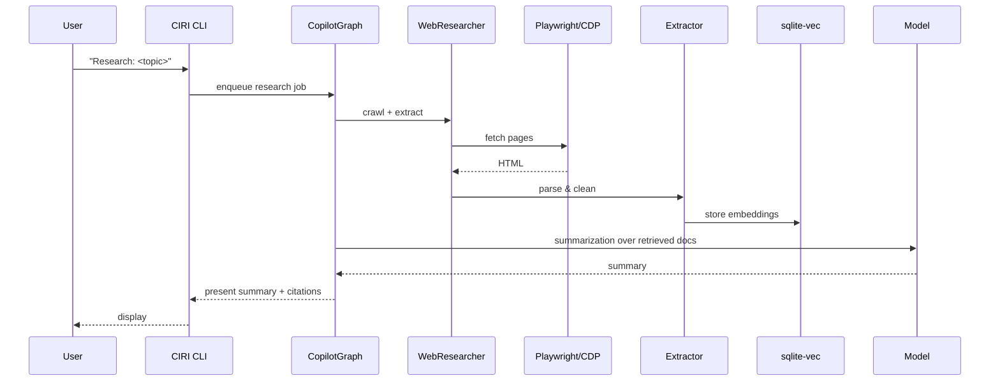

# Advanced Research Assistant (Detailed)

This guide walks through a full research workflow using CIRI: web crawling, extraction, embedding, retrieval, and summarization. It ties implementation to real files and shows what to expect.

Why this is useful
- Turn a research prompt into a reproducible brief with citations
- Automate data extraction while keeping human-in-the-loop approvals
- Store and reuse embeddings locally for fast retrieval

Architecture recap
- Web crawling & browser automation: Playwright + CDP (see `src/copilot.py` and `src/utils.py`) 
- Extraction & embedding: langchain-unstructured + sqlite-vec
- Summarization: LangChain model via LLMConfig and `llm_config.init_langchain_model()`

Sequence diagram (high-level)



Step-by-step practical example

1. Ensure environment:

```bash
uv sync --dev
uv pip install -e .
playwright install
export OPENROUTER_API_KEY="your-key"
```

2. Start CIRI:

```bash
ciri
# or
python -m ciri.__main__
```

3. In the prompt, ask the agent:

```
Research: "Best practices for retrieval-augmented generation (RAG) in 2026"
```

4. CIRI will build a research plan. If it needs to open a browser (Playwright) it will use the CDP endpoint created by `launch_browser_with_cdp()` (see `src/copilot.py`). If browser access is unavailable it will fall back to non-browser fetch.

Implementation pointers (code locations)

- Graph and subagent creation: `src/copilot.py` → `create_copilot()` — builds `web_researcher` via `build_web_researcher_agent()`.
- Browser profile copy & launch: `src/utils.py` → `resolve_browser_profile()` and `launch_browser_with_cdp()`
- Model initialization: `src/copilot.py` uses `LLMConfig.init_langchain_model()` (see `src/serializers.py` for LLMConfig structure)
- Extraction and embedding: look for adapters in `src/toolkit/` or in subagent implementations under `src/subagents/` and installed skills under `.ciri/skills/`

Privacy & safety checklist

- Review robots.txt and rate-limit configuration when crawling
- Avoid storing raw HTML long-term unless necessary — prefer extracted text or embeddings
- Keep API keys in environment or OS keychain; do not commit .env

Advanced tips

- Use the `crawler_browser_config` passed to `create_copilot()` to customize timeouts, allowed domains, and concurrency.
- For large-scale research, export embeddings to an external vector DB (e.g., PostgreSQL + pgvector) and point retrieval to that DB.
- Use the MemoryMiddleware to store summaries and decisions in `.ciri/memory/` for future context.
