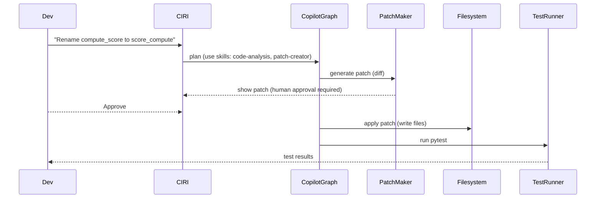

# Code Refactor Flow (Human-in-the-loop)

This tutorial demonstrates a common developer workflow where CIRI proposes a code fix or refactor, you review it, and CIRI applies it and runs tests.

Real-world scenario: rename function `compute_score` to `score_compute` across the codebase and update tests.

Mermaid flow

Step-by-step

1. Start CIRI:

   ciri

2. Ask it to rename the function:

   Rename `compute_score` to `score_compute` across the repo and update tests.

3. Review the proposed diff shown in the prompt and approve.
4. CIRI will apply the changes and run pytest; inspect failures and iterate.

Implementation pointers
- Patch generation uses high-level middleware and skills that produce diffs; look for patch helpers in `src/middlewares` or `.ciri/skills/patch`.
- The human-in-the-loop middleware (HumanInTheLoopMiddleware in deepagents) enforces approval before write operations.
- Tests are invoked programmatically (the agent may call pytest as a subprocess); prefer running tests locally in a venv for debugging.
