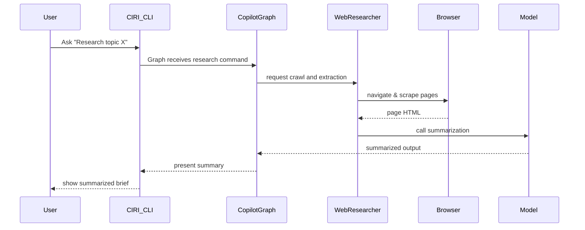
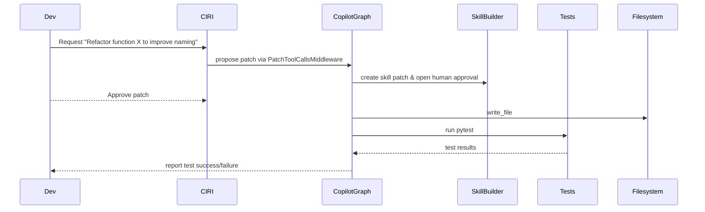
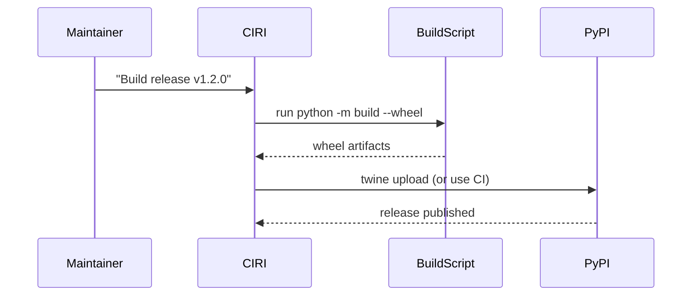

# Use Cases & Tutorials

This section contains practical, real-world workflows for CIRI. Pick a tutorial to get hands-on with common tasks:

- [Advanced Research Assistant](advanced-research.md)
- [Code Refactor Flow (Human-in-the-loop)](code-refactor.md)
- [Release Automation (Packaging & Publishing)](release-automation.md)

---

## Real-world Scenarios

### Use case 1: Research assistant with browser-based crawling and summarization

- Goal: Given a topic, CIRI will browse the web (using Playwright + browser CDP), extract relevant pages, and summarize them into a brief.

#### Flow

#### Implementation pointers
- The web researcher agent is built in `src/copilot.py` via `build_web_researcher_agent()` and uses Playwright and the crawler browser config.
- Ensure Playwright browsers are installed (`playwright install`) and CDP is available if using the user's browser profile.

---

### Use case 2: Local codebase assistant that modifies code with human-in-the-loop

- Goal: Make a small code change (refactor a function), run tests, and produce a PR.

#### Flow

#### Notes
- Human-in-the-loop middleware ensures tool actions (edit_file/write_file) require approval before execution.
- PatchToolCallsMiddleware can create patches for the user to inspect.

---

### Use case 3: Automating release packaging and publishing to PyPI

#### Flow

#### Implementation pointers
- Packaging is handled by hatchling (pyproject.toml). For release automation consider adding a GitHub Actions workflow that runs build and twine in CI with secure secrets.
