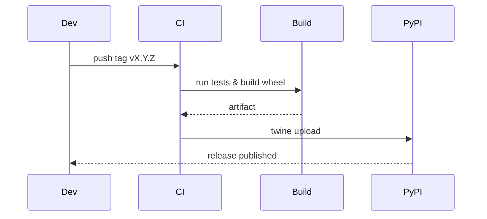

# Release Automation (Packaging & Publishing)

This tutorial shows how to build a wheel and prepare a release using hatchling and twine, and how to integrate this into CI.

Steps:

1. Build a wheel locally:

```bash
python -m build --wheel
```

2. Verify the package:

```bash
python -m pip install dist/ciri-copilot-*.whl
```

3. Upload to PyPI using twine (use API token stored in CI secrets):

```bash
twine upload dist/* -u __token__ -p $PYPI_API_TOKEN
```

CI recommendations:
- Use GitHub Actions with job matrix for platforms and Python versions
- Use `actions/setup-python` and cache pip
- Use `pypa/gh-action-pypi-publish` or twine with secrets

Mermaid flow


